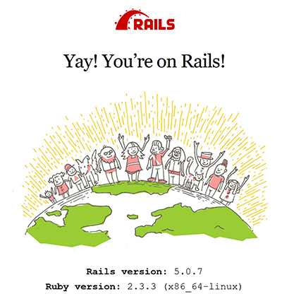

# Docker & Rails example

This is an example to build and run your Rails app on Docker.

## For Windows users

Replace `` `pwd` `` with `%CD%` in your Command Prompt or PowerShell.

Otherwise you would see an error like following:

> docker: Error response from daemon: create \`pwd\`/app: “`pwd`/app” includes invalid characters for a local volume name, only “[a-zA-Z0-9][a-zA-Z0-9_.-]” are allowed. If you intended to pass a host directory, use absolute path.

# Preparation

You need followings:

- Docker installed

You also need Rails image for Docker, but it will be downloaded automatically.

# Create a new Rails app

1. Prepare a directory for the app
2. Run `rails new` in Docker
3. Describe an image for your app where gems are installed
4. Database configuration
5. Prepare Docker component file with database specification
6. Ignore database files
7. Up them
8. Stop them (once)
9. Open another console
10. Initialize database
11. Open in browser

We name the app "my-great-app".
Please do not forget replace this with your great app's name.

Directory structure would be this:

```
my-great-app/
+ app/
|  - (Rails app files like `config.ru`)
+ db/
|  - (Database files)
+ .gitignore
+ docker-compose.yml
+ Dockerfile
+ README.md
```

## Prepare a directory for the app

```console
$ mkdir my-great-app
$ cd my-great-app
```

We will be working here.

## Run `rails new` in Docker

1. Start docker container
2. Run the command
3. Exit from docker container

First of all, run a docker container:

```console
$ mkdir app
$ docker run --rm -ti -v `pwd`/app:/app rails:5.0.1 bash
```

`5.0.1` is a tag of the image, as Rails version. Find available tags here:

- [library/rails - Docker Hub](https://hub.docker.com/r/library/rails/tags/)

This should take long time when you try at the first time since Docker downloads a Docker image of Rails. From next time, it would up soon.

Then you'll see you are in docker container. You may want to check the rails version:

```console
root@b4227fbcb3b1:/# rails --version
Rails 5.0.1
root@b4227fbcb3b1:/#
```

Note that, inside a Docker container, you cannot use `Ctrl-P`. This is a special key for Docker.

In the container, run `rails new` with some options.

```console
root@b4227fbcb3b1:/# rails new my-great-app --skip-bundle --database=mysql
      create
      create  README.md
      create  Rakefile
      create  config.ru
...
      create  vendor/assets/stylesheets
      create  vendor/assets/stylesheets/.keep
      remove  config/initializers/cors.rb
root@b4227fbcb3b1:/#
```

`--skip-bundle` option, as you read, skips `bundle install`.
The installation will happen later so you don't do that for now.

`--database` option is up to you.
In this tutorial, we chose MySQL as the DBMS for our Rails app.

Since we skipped `bundle install`, we need empty lock file for after operation.

```console
$ touch /my-great-app/Gemfile.lock
```

To expose result to you host computer, move the generated files to the shared volume. And exit.

```console
root@b4227fbcb3b1:/# cp -rT my-great-app/* /app
root@b4227fbcb3b1:/# exit
```

`-T` option of `cp` is to copy dot files (`.gitignore`).

(The reason we didn't generate files directly in `/app` is Rails generates files using the directory name with template. Please let me know if you know the way to do that directly.)

Check the files exist on your computer outside Docker container.

```console
$ ls -a app/
.   .gitignore  Gemfile.lock  Rakefile  bin     config.ru  lib  public  tmp
..  Gemfile     README.md     app       config  db         log  test    vendor
```

## Describe an image for your app where gems are installed

Create a new file named `Dockerfile`, which has no extension:

```dockerfile
FROM rails:5.0.1

RUN mkdir /app
WORKDIR /app

COPY ./app/Gemfile /app/Gemfile
COPY ./app/Gemfile.lock /app/Gemfile.lock

RUN bundle install
CMD rm /app/tmp/pids/server.pid ; rails s
```

## Database configuration

Although we haven't got database ready yet, modify rails configuration a little.

Change `host: localhost` to `host: db` in `app/config/database.yml`:

```yml
default: &default
  adapter: mysql2
  encoding: utf8
  pool: 5
  username: root
  password:
  host: db
```

This `db` will be used in the next step as a service name in `docker-compose.yml`.

## Prepare Docker component file with database specification

Create a new file named `docker-compose.yml` as following:

```yml
version: "3"

services:

  rails:
    build: ./
    ports:
      - "3000:3000"
    volumes:
      - ./app:/app
    depends_on:
      - db

  db:
    image: mysql
    volumes:
      - ./db:/var/lib/mysql
    environment:
      MYSQL_ALLOW_EMPTY_PASSWORD: "true"
```

This prepares a database for root user without password.
It's dangerous in some cases but no problem for development.

## Ignore database files

If you use git, create `.gitignore`  and ignore database files:

```
/db/
```

## Up them

```console
$ docker-compose up
```

This takes longer time for the first time.

First, it builds an image from your `Dockerfile` for your project. This process includes `bundle install`.

Second, after starting, MySQL creates database files in `db`.

Take your time until your console gets calm down.

## Stop them (once)

Try to stop the containers by holding `Ctrl-C` in the console. Closing process may take time. Be patient.

If you get how to up and end it, up again and move on to the next.

## Open another console

Keep the Docker containers running.

While they are running, you need to open a new console to work.

## Initialize database

Type this to create database in the 2nd console while running `docker-compose up` in the 1st one.

```console
$ docker-compose exec rails rake db:create
Created database 'my-great-app_development'
Created database 'my-great-app_test'
```

## Open in browser

Open [`http://localhost:3000/`](http://localhost:3000/) and look at what you have done! Yay! You’re on Rails!



# Up your project from the next time

Now it's simple.

```console
$ docker-compose up
```

And open [`http://localhost:3000/`](http://localhost:3000/).

You may need the 2nd console to run commands like `rails g scaffold`.

# Update your project

## General idea

You may want to run `rails`, `rake` or any other commands. For those cases, the most basic idea is running `docker-compose exec rails xxx`.

Let's say you want to `echo` here. You would use this:

```console
$ docker-compose exec rails echo Hello from Docker container!
```

Please remember you have to type this command into your 2nd console, next the 1st one where your `docker-component up` is running.

## When you want to generate a scaffold

```console
$ docker-compose exec rails rails g scaffold post title:string body:text
      invoke  active_record
      create    db/migrate/20180806212720_create_posts.rb
      create    /models/post.rb
...
      create      /assets/stylesheets/posts.scss
      invoke  scss
      create    /assets/stylesheets/scaffolds.scss
```

Don't forget migration! (See next chapter.)

## When you generated a new migration

```console
$ docker-compose exec rails rake db:migrate
== 20180806212720 CreatePosts: migrating ======================================
-- create_table(:posts)
   -> 0.0766s
== 20180806212720 CreatePosts: migrated (0.0769s) =============================
```

## When you want to run test

```console
$ docker-compose exec rails rake test
Run options: --seed 52703

# Running:

.......

Finished in 1.302024s, 5.3762 runs/s, 6.9123 assertions/s.
7 runs, 9 assertions, 0 failures, 0 errors, 0 skips
```

## When you added new gems

When you update `Gemfile`, you used to run `bundle install`.

With Docker, you need to rebuild your image instead. This process includes `bundle install` and updates `Gemfile.lock`.

To rebuild, give `--force-recreate` option.

```console
$ docker-compose.exe up --build
```

Otherwise you would see an error like this:

```
rails_1  | /usr/local/lib/ruby/gems/2.3.0/gems/bundler-1.13.7/lib/bundler/resolver.rb:366:in `block in verify_gemfile_dependencies_are_found!': Could not find gem 'carrierwave' in any of the gem sources listed in your Gemfile or available on this machine. (Bundler::GemNotFound)
rails_1  |      from /usr/local/lib/ruby/gems/2.3.0/gems/bundler-1.13.7/lib/bundler/resolver.rb:341:in `each'
...
rails_1  |      from /usr/local/bundle/bin/rails:15:in `<main>'
```

# Up somebody's project

These steps should be described in the project's README documentation.

1. Clone the repository
2. Up
3. Initialize database

Let's say the project is named "the-great-app".

## Clone the repository

```console
$ git clone ...
$ cd the-great-app
```

## Up

```console
$ docker-component up
```

Hold `Ctrl-C` to stop.

## Initialize database

Open another console and run:

```console
$ docker-component exec rails rake db:create db:migrate db:seed
```

## Open in browser

Open [`http://localhost:3000/`](http://localhost:3000/) and start your job.
